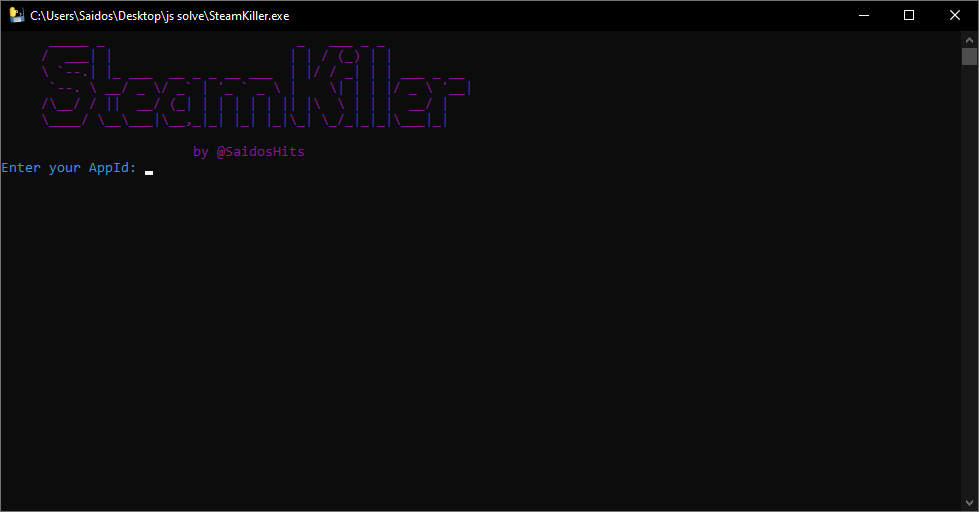

# Manifaste Lua Steam Downloader

A Python script that downloads ZIP files using an AppId from the Manifaste Lua Steam Downloader service.  
Supports downloading most games by retrieving the download link from the service API.

---

## Example Screenshot

<!-- Add your screenshot image file named "screenshot.png" in the repo root -->




## Features

- Downloads ZIP files based on the provided AppId.
- Supports most games available on the service.
- Saves downloaded ZIP files inside a `result` folder.
- Colorful console output for easy status tracking.

---

## Usage

Clone this repo or download the script file.

Run the script:

bash
Copy
Edit

Enter your AppId when prompted.

Wait for the ZIP file to download.

Find your downloaded ZIP file in the result folder.

How to use the downloaded Manifest files
Download and install Steam Tools from https://steamtools.org/.

Open Steam Tools.

Drag and drop the downloaded manifest ZIP files (or extracted manifests) into Steam Tools.

Steam Tools will process the manifest and add the corresponding game to your Steam library.

## Requirements

- Python 3.6+
- Modules: `requests`, `colorama`

Install dependencies with:

```bash
pip install requests colorama
